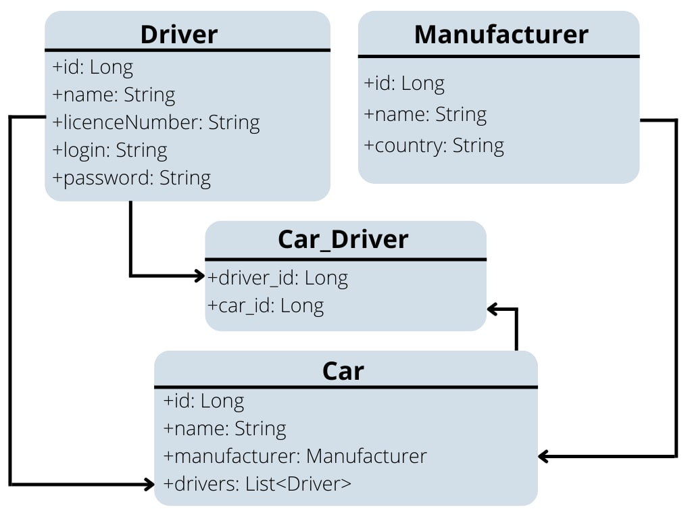

# 🚖Taxi-service🚖
## Project description:
``````
A simple web-application that supports driver registration, authentication. After registration you can see registered drivers, available cars, manufacturers and what driver which car drives, add, update and remove them. 
``````
## Features:
- registration like a driver;
- authentication like a driver
- create/update/remove a manufacturer;
- create/update/remove a car;
- add driver to car;
- display all drivers;
- display all cars;
- display all manufacturers;
- display driver's cars;
## Reference on Heroku:
- https://dry-basin-82210.herokuapp.com/
## Technologies:
- SOLID principles;
- based on JDBC (Java Database Connectivity) standard;
- JSP (JavaServer Pages) technology;
- Servlet technology;
- HTML;
- CSS;
- Dependency injection technique;
## Launch project:
- clone it to your IDE (Integrated Development Environment);
- exchange plugs for valid values in ConnectionUtil file;
- set up configuration for a web server (tomcat, for example);
- follow the commands you will see on your opened browser page;
## Structure of the project:
